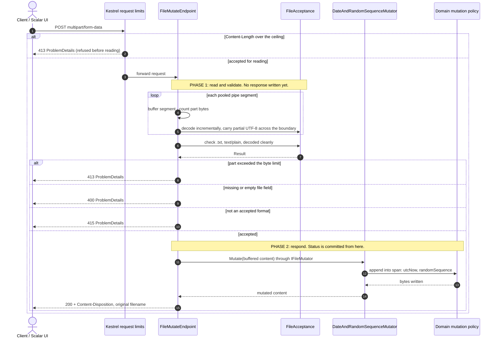

# File Mutation API

[](https://github.com/fabiantax/zero-allocation-fileupload/actions/workflows/ci.yml)
[](https://github.com/fabiantax/zero-allocation-fileupload/blob/main/.github/workflows/ci.yml)
[](https://dotnet.microsoft.com)
[](LICENSE)

A .NET 10 REST API that accepts one UTF-8 `.txt` file, appends a newline followed by the
current UTC date and a 16-character random sequence, and returns the result as a download under
the submitted filename.

[Run it](#run-locally) · [Verify it](#test-and-verify) · [Assumptions](docs/assumptions.md) · [Design record](#design-record)

## Why it is built this way

A request body has no fixed size, so materializing it (an array, a stream copy, or a string)
makes memory per request proportional to upload size. At the configured 10 MiB ceiling, the
measured naive baseline allocates 20.9 MB for input and concatenated output; those arrays reach
the large-object heap and are collected in Gen2, so under load GC pauses and tail latency occur
at a rate an untrusted client controls through upload size and concurrency. Validation written
inside the endpoint also runs only inside HTTP. The upload is instead read through
`System.IO.Pipelines` into pooled 16 KiB segments below the roughly 85,000-byte LOH threshold,
while acceptance lives in a plain `Application` class that takes bytes and knows nothing about
ASP.NET Core. The precise claim is no large-object-heap allocation for file content and bounded
pooled memory per request: 784 B per operation at 1 KB and 256 KB, 792 B at 10 MB, flat across
sizes, though at 1 KB this path is 2.58× slower than the naive path. The full measurements are
recorded in [the allocation benchmark results](docs/benchmarks/allocation-results.md).

What happens to one upload, end to end. The two-phase ordering is what makes every rejection
carry a correct status instead of a truncated success:



The layer view and the request-lifecycle state machine are in
[docs/architecture.md](docs/architecture.md).

## Run locally

Install the .NET SDK `10.0.301`, then:

```bash
dotnet run --project src/FileMutation.Api
```

The application prints its base address on startup (`http://localhost:5080` with the default
profile). Append `/scalar/v1` for the interactive UI, or `/openapi/v1.json` for the machine
contract. In Scalar, expand `POST /files/mutate`, select **Try it**, and upload a file in the
`file` field. A file is accepted when its name ends in `.txt`, its multipart content type is
`text/plain`, and its content is valid UTF-8; anything else is rejected with a ProblemDetails
body and the matching status code.

A command-line round trip:

```bash
curl --fail-with-body \
  --form 'file=@example.txt;type=text/plain' \
  --remote-header-name \
  --remote-name \
  http://localhost:5080/files/mutate
```

The default maximum file size is 10 MiB plus 64 KiB of multipart framing; both are configurable
under `Upload` (see [the assumptions page](docs/assumptions.md) for the defaults and their
reasons).

**Container or Codespaces:** open the repository in VS Code and run *Dev Containers: Reopen in
Container*, or use the **Open in Codespaces** button. The dev container uses the official
`mcr.microsoft.com/devcontainers/dotnet:1-10.0` image and forwards ports 5080 (HTTP) and 7080
(HTTPS); once open, `dotnet run` behaves exactly as locally.

## Test and verify

```bash
dotnet test
```

CI additionally gates **branch** coverage at 80%, enforces XML documentation on public members,
and runs the [allocation benchmarks](docs/benchmarks/allocation-results.md) outside the coverage
run. The boundaries between these suites and their trade-offs are recorded in
[ADR 0007](docs/adr/0007-testing-strategy.md).

## Assumptions and open questions

The source ticket leaves details unspecified; the defaults taken are recorded with their
reasoning on a dedicated page: [docs/assumptions.md](docs/assumptions.md). In short:

- One accepted format: UTF-8 `.txt` declared `text/plain`. Files that decode as text but carry
  structure (`.json`, `.csv`, `.xml`) are rejected, because appending to them corrupts them
  while every check reports success.
- Exactly one non-empty `file` part per request; 10 MiB default ceiling; the response is
  synchronous, chunked, and nothing is persisted.
- Persistence, authentication, rate limiting, audit, and queueing were each considered and
  declined for a stated reason. The exclusions table and the questions for the product owner
  are on [the assumptions page](docs/assumptions.md).

## Design record

| Topic | Record |
|---|---|
| Decisions and corrections as the design evolved | [Decision log](docs/decision-log.md) |
| System structure and request flow | [Architecture](docs/architecture.md) |
| Scope, deliberate exclusions, and accepted formats | [Assumptions](docs/assumptions.md) |
| Native AOT: proven, then parked | [ADR 0001](docs/adr/0001-native-aot.md) |
| Four-project structure, ports, and no aggregate root | [ADR 0004](docs/adr/0004-solution-structure-ddd-ports.md) |
| Streaming, buffering, and the allocation claim | [ADR 0005](docs/adr/0005-streaming-allocation-strategy.md) |
| Built-in OpenAPI plus Scalar | [Decision log](docs/decision-log.md#an-openapi-ui-without-swashbuckle) |
| Test, architecture, coverage, and benchmark boundaries | [ADR 0007](docs/adr/0007-testing-strategy.md) |
| No persistence and no repository port | [ADR 0008](docs/adr/0008-persistence-deferral.md) |

An independent review on 2026-09-22 caught the two-phase ordering defect before implementation;
its adopted finding is recorded in ADR 0005.

## Contributing

Enable the repository's pre-commit checks once per clone:

```bash
git config core.hooksPath hooks
```

The hook enforces issue traceability and prevents client-identifying terms from entering this
public repository. Run the build and tests before submitting a change.

## Licence

MIT — see [LICENSE](LICENSE).
