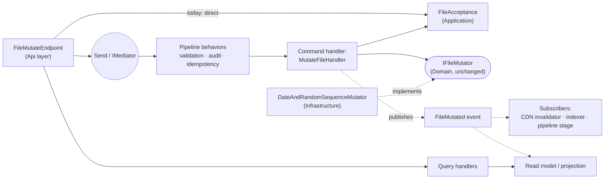

# 2. CQRS and mediator choice

## TL;DR

Three candidates were compared on paper for dispatching this API's single command:
MediatR, a hand-rolled dispatcher, and Wolverine's local command bus. The hand-rolled
dispatcher wins the comparison, but nothing is adopted: with one command, one handler,
and zero event listeners, a mediator is indirection whose convention has no second
participant. The direct endpoint-to-port call stays. The addendum below records when
each capability would start paying, and the triggers that would reopen this decision.

## Feature map

| Capability | What it is | Earns its keep when | This codebase today |
|---|---|---|---|
| Command dispatch (`Send`) | One entry convention for every request type | Dozens of request types; adding one means adding a class, not editing the composition root | One command. No convention to share |
| Pipeline behaviors | Decorator chain applying validation, audit, transactions, caching, idempotency to every handler | About three or more use cases sharing two or more concerns | One use case; acceptance lives as a plain Application rule already |
| Handler discovery | Convention or assembly scanning finds handlers | Feature teams ship vertical slices in parallel without touching shared wiring | One contributor, one composition root |
| Event publish/subscribe | A handler announces; any number of subscribers react | The first real listener exists (CDN invalidator, pipeline stage, indexer) | Zero listeners; a published event would be silence |
| Orchestration runtime (sagas, outbox, retries) | Durable state and error policies for multi-step workflows | The process outlives the request or spans systems | Synchronous transient operation; nothing persists |
| CQRS read/write split | Separate models for reads and writes | The read path evolves independently of writes | No read model exists |

## Status

**Accepted, research-only**: 2026-09-22. No mediator is implemented; the ADR is the complete
deliverable of this evaluation.

**Winner:** the hand-rolled `IRequest`/`IRequestHandler` dispatcher wins the paper comparison,
but this codebase adopts none of the three and keeps the endpoint calling `IFileMutator` directly.

## Context

The endpoint on `main` already performs one command. It parses the multipart request into pooled
`Pipe` segments, applies the HTTP-independent acceptance rule in
[`FileAcceptance`](../../src/FileMutation.Application/FileAcceptance.cs), and, only after the
whole upload is accepted, delegates the transformation to the existing
[`IFileMutator`](../../src/FileMutation.Domain/Ports/IFileMutator.cs) port. The evaluation assumes
the settled stack: .NET 10 on SDK 10.0.301, Native AOT off per ADR-0001, and no persistence.
There is no read model, and the accepted format remains exactly one: `.txt`, declared
`text/plain`, decoded as UTF-8. There is consequently no dispatch question: with one command and
one handler, CQRS's read/write separation has no divergence to manage.

That absence is a finding, not an oversight. The evaluation therefore asks a narrow procurement
and design question: if a mediator were introduced, which surface would be least unsuitable for
this code? It does not assume that one should be introduced.

The comparison is paper-only. The implementation variant is closed as not planned. Separately, the
planned extraction of a reusable file-processing service from the endpoint is plain dependency
injection: one service called directly through a constructor-injected interface. It creates no command abstraction,
handler discovery, or dispatcher, and is not a way of adopting this ADR's outcome indirectly.

Only three candidates were compared:

1. MediatR's `ISender`/`IRequestHandler` surface.
2. A hand-rolled `IRequest`/`IRequestHandler` dispatcher resolved by the built-in DI container.
3. Wolverine's in-process command surface: `IMessageBus.InvokeAsync` dispatching to a handler
   method, as described in [Wolverine's local mediator documentation](https://wolverinefx.net/guide/basics).
   Its capabilities beyond local invocation were excluded from the score.

**MediatR licensing.**

Licensing is a procurement fact, not a stylistic preference. The current Lucky Penny Software
License Agreement, version 2.0, was checked from the official source at
<https://luckypennysoftware.com/license> on 2026-09-22. It states that MediatR `13.0.0` and later
are Commercial Versions, while earlier MediatR releases remain available under their prior
Apache-2.0 terms. The repository's [LICENSE.md](https://github.com/LuckyPennySoftware/MediatR/blob/main/LICENSE.md)
also offers the source under Reciprocal Public License 1.5; using it without accepting that
license's reciprocal obligations instead requires Lucky Penny's commercial agreement.

The Community licence is available to an entity with gross annual revenues of less than
USD 5,000,000 in every qualifying year, and to non-profit organizations with an annual budget
below the same amount. Eligibility has additional restrictions: the organization must never have
received more than USD 10,000,000 in outside private-equity or venture capital, controlled entities
are aggregated, and government and quasi-government agencies are excluded. Community use remains
perpetual only while eligibility continues. Paid tier prices are set in an applicable order and
were not requested, so none are asserted here.

This repository is a public technical trial, but commercial-library eligibility belongs to the
client rather than to this codebase. Adopting MediatR would therefore require explicit client
procurement confirmation before deployment, even if the current project appeared to qualify.

## Community health of the two third-party candidates

Numbers fetched from the GitHub API on 2026-09-22. A dependency's maintenance reality is as much a
procurement fact as its licence text; these figures are what the API reported on that date, not a
trend analysis.

| Signal | [MediatR](https://github.com/LuckyPennySoftware/MediatR) | [Wolverine](https://github.com/JasperFx/wolverine) |
|---|---:|---:|
| Stars | 11,860 | 2,356 |
| Forks | 2,183 | 380 |
| Contributors (incl. anonymous) | 92 | 227 |
| Open issues | 0 | 49 |
| Latest release | v14.2.0 (2026-07-02) | V6.39.1 (2026-09-19) |
| Last push | 2026-07-02 | 2026-09-20 |
| Created | 2014 | 2022 |
| Archived | no | no |

Both are alive. MediatR shows the larger user base and zero open issues, but its last release and
push are roughly two and a half months old at the time of checking, consistent with a mature
library in maintenance mode rather than active development. Wolverine is younger and far more
active, with a broader contributor base relative to its size, at the cost of an issue tracker that
reflects a project still moving quickly. Neither figure changes the decision above: they describe
the cost of *adopting* a dependency at all, and the finding here is that there is no dispatch
problem that justifies one. The hand-rolled option has no row in this table. Its maintainer,
contributor and issue tracker would be this repository itself, which is exactly the "code we own
forever" cost listed under Consequences.

## Decision

**Winner:** the hand-rolled `IRequest`/`IRequestHandler` dispatcher wins the paper comparison,
but this codebase adopts none of the three and keeps the endpoint calling `IFileMutator` directly.

The current composition is the right one for one synchronous command:

| Candidate | Assessment |
|---|---|
| MediatR | Familiar and well documented, but its mainstream benefit — a common dispatch convention for many requests — is absent here. MediatR v13+ introduces licence review and either Community-eligibility evidence or a paid commercial entitlement. A third-party dispatcher is procurement and dependency cost with no corresponding dispatch problem. |
| Hand-rolled dispatcher | With built-in DI, a minimal request/handler pair can be explicit, licence-free, and shaped around the existing streams and result types. It wins only as a fallback. Its cost is code this repository owns forever: registration, lifetimes, error propagation, and tests for a dispatcher that currently has exactly one call site. |
| Wolverine | [MIT-licensed](https://github.com/JasperFx/wolverine/blob/main/LICENSE) (checked 2026-09-22), and its `IMessageBus.InvokeAsync` surface can act as a local command bus. It still brings a framework-sized host, configuration, and execution model to a one-command API. That dependency is not justified by local invocation alone; capabilities outside this comparison were neither counted nor needed. |

No mediator is implemented. The implementation variant is closed as not planned, and task 009 ships this document
alone. The direct endpoint remains on `main`.

Had implementation been approved, any of the three candidates would be required to call the same
`FileAcceptance.Evaluate` rule and the same `IFileMutator` port rather than duplicate either. The
guarantee would be mechanical: the handler would constructor-inject `IFileMutator`; the composition
root would register the existing Infrastructure adapter as its only implementation; the command
would carry the already-buffered content and declared metadata, not a second acceptance policy;
and an ArchUnitNET rule would fail if a second `IFileMutator` implementation appeared. The existing
`FileAcceptance` tests and endpoint behaviour tests would remain unchanged so the mediator could
change composition only, never observable behaviour.

This decision is deliberate YAGNI, not an unexamined default. A mediator would not make this
endpoint CQRS: there is one command, no second read model, no persistence, and no independently
changing query path. CQRS's separation buys nothing here.

## Addendum (2026-09-23): when a mediator earns its keep

The rejection above is about this codebase's size, not about the pattern. The same
indirection that is pure cost at one command becomes the cheapest way to organize a
large one, and the honest version of this ADR says where the line is.

**Dispatch at count.** With one use case, a mediator is an extra hop whose convention has
no second participant. At dozens of request types the convention inverts: every use case
enters through the same `Send` call, the caller stops knowing handler types, and adding a
use case means adding a class without editing a composition root. The wiring cost is paid
once; the per-use-case cost approaches zero.

**Pipeline behaviors are the real prize.** A mediator's decorator chain applies
cross-cutting concerns, such as validation, logging, transaction scopes, caching,
authorization, or idempotency, to every handler without each handler mentioning them.
Direct composition repeats those concerns per service, or grows a hand-built decorator
stack that is a worse-maintained copy of what the library ships. A rough rule: with at
least three use cases and at least two shared concerns, behaviors have amortized their
introduction. This is the feature most teams adopting MediatR actually came for.

**Solution and team scale.** Convention-based handler discovery lets vertical slices
arrive self-contained: a feature module registers its own handlers, senders depend on
message contracts rather than handler assemblies, and parallel teams stop colliding on a
shared composition root. In a solution with tens of projects that is an organizational
property first and a technical one second. It is meaningless at one handler.

**Long-running workflows are a different question.** When "process" means state that
outlives a request (a saga, an outbox, retries with durability, scheduled continuation),
a full runtime such as Wolverine or MassTransit earns its framework footprint: durable
messaging, error policies, and persisted orchestration state. That is not a mediator
anymore; it is an orchestration engine, and it is justified by workflow requirements
(spans systems, survives restarts, needs compensation), never by request count alone.

**Events are the same arithmetic.** A mediator also offers publish/subscribe: a handler
publishes a domain event and any number of subscribers react. Today this API has zero
subscribers, so publishing a `FileMutated` event would be code whose only output is
silence. Events earn their keep the moment a real listener exists, and no sooner.

**What that would look like for this domain, concretely.** Suppose the API grows into
the shared file-processing platform the PRD anticipates. A downstream system starts
consuming mutated files as a pipeline stage: it listens for `FileMutated` and fetches or
processes the result. Files begin landing in object storage behind a CDN, and a stale
cached copy after a mutation becomes a correctness bug, so a subscriber invalidates the
CDN keys for that filename on every event. A search indexer re-indexes on the same
event. At that point there are also more commands (fetch, list, delete) sharing
validation and audit logging, which is exactly the pipeline-behavior shape above: one
`AuditLoggingBehavior` and one `IdempotencyBehavior` wrap every handler instead of being
repeated per service. None of that is hypothetical architecture to build now; it is the
picture that tells a reviewer the dismissal is informed rather than reflexive.

How the pieces would slot into the existing layers. Solid lines are the request path a
mediator would introduce; dashed lines exist only once someone listens. Domain and its
`IFileMutator` port are unchanged: the mediator sits between the endpoint and the seams
that already exist.

Reads and writes split at the dispatcher: commands flow through behaviors to the
mutation seams above; queries answer from the projection, which the event keeps fresh.
That split is what the letters in CQRS name, and it is exactly the part with no
divergence to manage while there is no read model.

**The costs scale too.** Every benefit above is an indirection: stack traces pass
through the dispatcher, behavior ordering becomes architecture that someone must own,
and the dependency brings its licence and upgrade lifecycle. A large solution that
adopts a mediator without the triggering shape pays the costs and receives a
convention it never uses.

**Triggers that would reopen this ADR for this codebase:** a third command sharing
concerns with the first two; the first real event subscriber (a CDN invalidator, a
pipeline stage, an indexer); a read model that evolves independently of the write path
(actual CQRS, not the buzzword); or a durable, multi-step workflow requirement. Absent
one of those, direct composition stays the right answer at any code quality bar.

## Consequences

- The endpoint and the future file-processing service keep direct, constructor-injected
  composition. There is no command DTO, handler, mediator package, licence gate, or dispatch
  indirection to maintain.
- The service gives up the conventions reviewers may recognize from MediatR: cross-cutting
  request behaviors, assembly-based handler discovery, and an ecosystem answer for future
  commands. None currently has a consumer.
- It also gives up the hypothetical local-command facilities Wolverine provides beyond direct
  dispatch. Those were outside this evaluation and were not scored.
- A future multi-command application must reopen this ADR rather than quietly add a dispatcher.
  Revisit only when there are multiple commands and independently evolving read/write needs, not
  merely a second file format.
- If reopened, the hand-rolled dispatcher is the first candidate because it has no procurement
  dependency, but the repository then owns its implementation and behavioural tests.
- No performance claim is made: the options were compared on paper only, and no benchmark or
  prototype was run.
