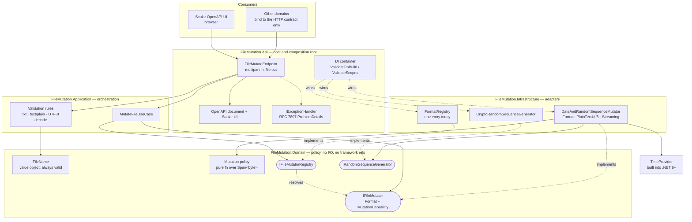
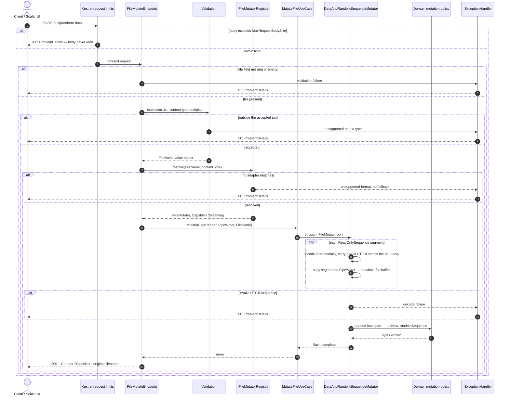
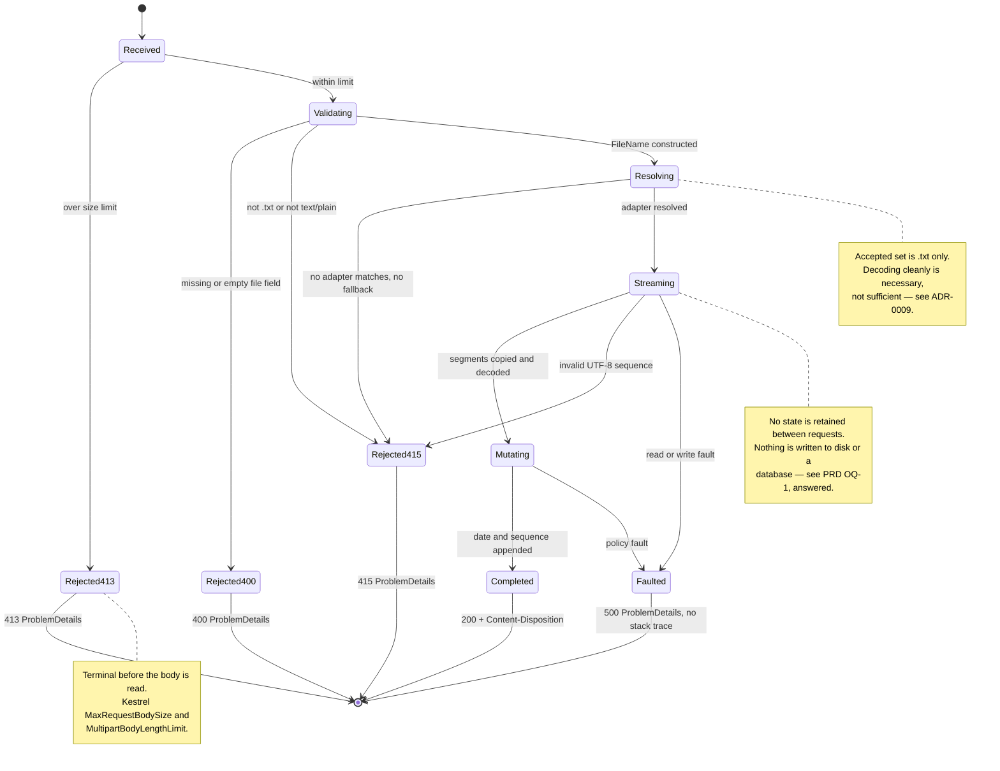

# Architecture

These diagrams describe the **designed** architecture. No code exists yet — they are the
contract tasks 001–004 build against, and they are expected to be corrected against reality
once those tasks land (task 010 owns that pass).

Source of truth for the decisions behind them: `.claude/epics/file-mutation-api/epic.md`.

> **Known unresolved issue — the late-validation problem.**
> The flow below streams mutated bytes to the response while still validating UTF-8, then shows
> an invalid sequence producing a 415. **That cannot work.** Once output is flushed the status
> and headers are committed, so the caller receives a truncated 200 instead. An independent
> review caught this; it is not yet fixed. Three ways out, none free:
> 1. Validate and spool the whole mutated body before the response starts — bounded memory via
>    `FileBufferingWriteStream`, but "never buffered whole" stops being true.
> 2. Drop content validation and treat the upload as opaque bytes — true streaming, but
>    `.json`/UTF-16 corruption comes back.
> 3. Keep streaming and document that a failure after response start aborts the body and
>    cannot return `ProblemDetails`.
>
> The diagrams still show the broken version deliberately, so the gap stays visible until the
> decision is made rather than being quietly papered over.

## 1. Structure — layers, ports and adapters

The dependency rule is the point of this diagram: **arrows only ever point inward**. Domain
and Application reference neither Infrastructure nor Api. `FileMutation.Architecture.Tests`
(task 007) enforces this with ArchUnitNET, so it is a build failure rather than a convention.

**Why the split between `POL` and `MUT` matters.** Domain owns *what* is appended and in what
format, as a pure function over spans. Infrastructure owns the `Pipelines` mechanics that feed
it. That keeps Domain I/O-free (Clean Architecture) *and* makes the hot path testable against a
stack-allocated span with no streams — the two goals reinforce rather than compete.

Format identity sits **on `IFileMutator`**, not on a second port — a parallel interface would
have taken the same inputs and returned the same outputs. `MutationCapability` (`Streaming` or
`BufferedRewrite`) is what stops a future container-format adapter from hiding that it must
buffer the whole file. The registry resolves one adapter or returns a rejection; it has no
fallback, so an unmatched format cannot silently become plain text. See ADR-0009.

There is deliberately **no `UploadedFile` aggregate root**. The operation is a stateless
transformation with no identity, lifecycle, or cross-entity invariants; inventing an aggregate
to look DDD-shaped would be cargo cult. See the epic's "Domain Modelling Stance".

## 2. Flow — one upload request, end to end

Note the ordering: the size limit is enforced by Kestrel **before the body is read**, so an
oversized upload never reaches the endpoint. A redundant length check downstream would never
fire.

Two different mechanisms, which an earlier version of this document wrongly conflated:

- **Expected validation failures return a result**, and the endpoint turns that result directly
  into `TypedResults.Problem`. They never throw — a rejected upload is an ordinary outcome, and
  throwing costs an allocation plus a stack unwind on a hot path.
- **`IExceptionHandler` handles unexpected exceptions only.** It is reached through the
  exception-handling middleware, so it cannot dispatch result-based validation failures, and it
  can only produce a response while one has not yet started.

## 3. State machine — request lifecycle

The machine has **no persisted state**: every terminal transition ends the request, and nothing
survives it. The mutated bytes go to the response and are then gone — there is no store, and
therefore no storage port.

## Mapping to the task breakdown

| Diagram element | Built by |
|---|---|
| API host, OpenAPI document, Scalar UI | 001 |
| `FileName`, mutation policy, ports, `FileFormat`, `MutationCapability`, registry | 002 |
| `DateAndRandomSequenceMutator`, segment handling | 003 |
| Endpoint, validation, `IExceptionHandler`, `Content-Disposition` | 004 |
| Dependency-rule enforcement | 007 |
