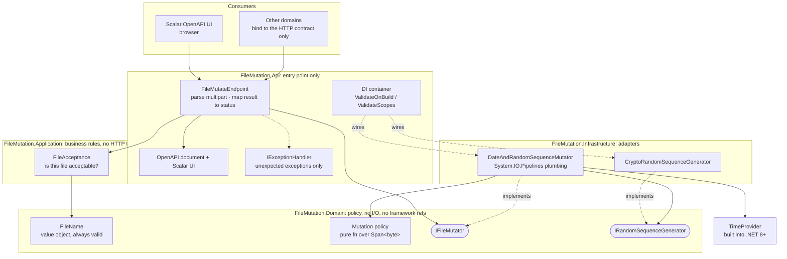
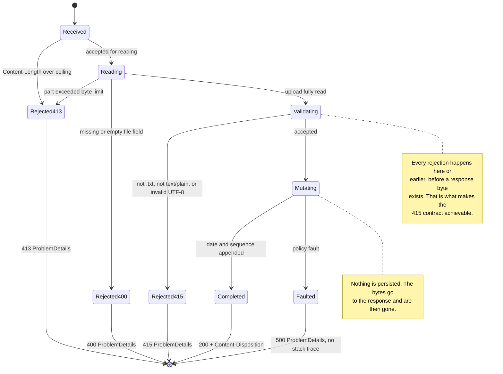

# Architecture

These diagrams describe the architecture as built. The decisions behind them are recorded in
`docs/decision-log.md` and the ADRs in `docs/adr/`.

## 1. Structure: layers and ports

The dependency rule is the point: **arrows only ever point inward**. Domain and Application
reference neither Infrastructure nor Api. `FileMutation.Architecture.Tests` enforces
this with ArchUnitNET for type-level dependencies, plus a `.csproj` reference check. ArchUnitNET
analyses compiled type usage, so an unused-but-forbidden project reference would otherwise pass.

If you know the pattern by name, this is Clean Architecture's dependency rule, combined with
ports and adapters. The mapping to the familiar circles: `Domain` is the entities layer,
`Application` the use cases, `Infrastructure` the interface adapters, `Api` the frameworks and
drivers ring. What was taken from the pattern is the rule (dependencies point inward, the core
knows no framework), not the ceremony: there is no aggregate root, no repository abstraction,
and no use-case interface for the single use case, each omission recorded in
[ADR 0004](adr/0004-solution-structure-ddd-ports.md).



**The API is an entry point, not an owner.** `FileAcceptance` decides whether a file is
acceptable, takes content plus declared metadata, references no ASP.NET Core types, and returns
a result. A unit test calls it with a byte array and no HTTP in scope; so could a console app or
a queue consumer. The endpoint parses multipart and maps the result to a status code.

**Policy vs plumbing.** Domain owns *what* is appended, as a pure function over spans;
Infrastructure owns the `Pipelines` mechanics that feed it. That keeps Domain I/O-free *and*
makes the hot path testable against a stack-allocated span with no streams.

There is **no aggregate root** and **no storage port**. The operation is a stateless
transformation with no identity or lifecycle, and nothing is persisted.

## 2. Flow: one upload request

**Read and validate everything, then write.** The two phases must not interleave: once a response
byte is flushed the status line is committed, so a late rejection could no longer be a 415. It
would arrive as a truncated 200.

```mermaid
sequenceDiagram
    autonumber
    actor C as Client / Scalar UI
    participant K as Kestrel request limits
    participant E as FileMutateEndpoint
    participant A as FileAcceptance
    participant M as DateAndRandomSequenceMutator
    participant D as Domain mutation policy

    C->>K: POST multipart/form-data

    alt Content-Length over the ceiling
        K-->>C: 413 ProblemDetails (refused before reading)
    else accepted for reading
        K->>E: forward request

        note over E,A: PHASE 1: read and validate. No response written yet.
        loop each pooled pipe segment
            E->>E: buffer segment · count part bytes
            E->>A: decode incrementally, carry partial UTF-8 across the boundary
        end
        E->>A: check .txt, text/plain, decoded cleanly
        A-->>E: Result

        alt part exceeded the byte limit
            E-->>C: 413 ProblemDetails
        else missing or empty file field
            E-->>C: 400 ProblemDetails
        else not an accepted format
            E-->>C: 415 ProblemDetails
        else accepted
            note over E,D: PHASE 2: respond. Status is committed from here.
            E->>M: Mutate(buffered content) through IFileMutator
            M->>D: append into span: utcNow, randomSequence
            D-->>M: bytes written
            M-->>E: mutated content
            E-->>C: 200 + Content-Disposition, original filename
            end
        end
    end
```

Every rejection is produced by the endpoint from a **result**, via `TypedResults.Problem`, not by
throwing. `IExceptionHandler` exists for *unexpected* exceptions only, and it too can only write
a response while one has not yet started.

The mutated body is streamed to the client as the mutator produces it, so the response is
chunked: how many bytes the suffix adds is the mutator's business, not the endpoint's. Buffering
the mutated copy purely to set `Content-Length` would double peak memory for a header.

## 3. State machine: request lifecycle



**Buffering, stated honestly.** Phase 1 holds the upload in pooled `Pipe` segments, each far below
the 85,000-byte large-object-heap threshold, so a 10 MB upload never produces a 10 MB array.
Peak memory per request is bounded by the configured maximum upload size and returned to the pool
afterwards. The claim is *no LOH allocation and bounded pooled memory per request*, not *nothing
is ever buffered*.
